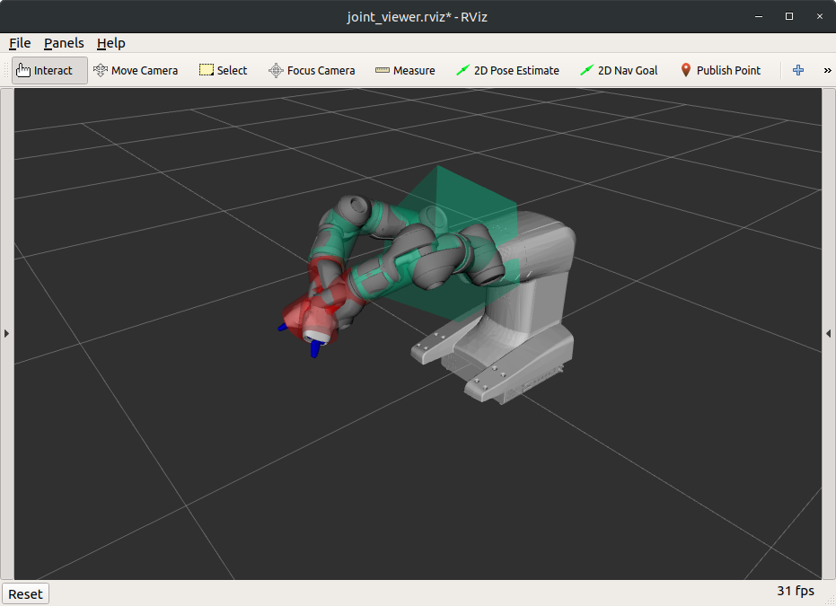
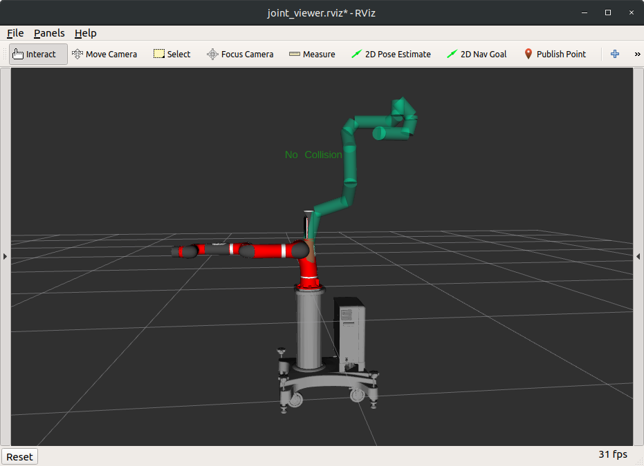
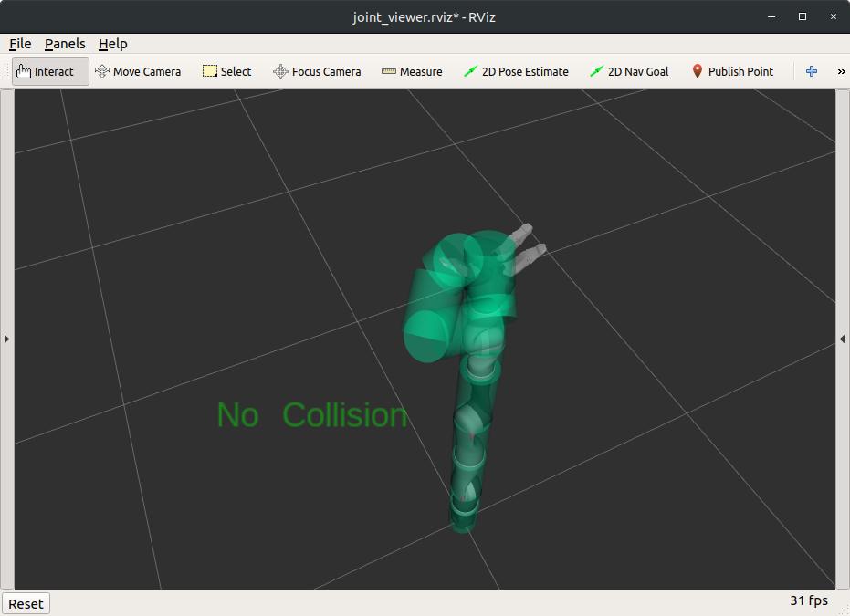

# relaxed_ik_core


## Run
* Enter the interactive mode by running: 
```
cargo run --bin relaxed_ik_node
```
* Then follow the prompt in the console to test a pre-computed robot
* The solver converges in expected time based on observation


## Test
* Run the regression tests by running:
```
cargo test --test regression_test -- --nocapture
```
Hide output from test execution by removing `-- --nocapture` and simply running:
```
cargo test --test regression_test
```
* All available pre-computed robots will be tested automatically during the regression test
* Test outputs will be generated at `relaxed_ik_core/tests/[robot_name]/output`, and they are compared with expected outputs at `relaxed_ik_core/tests/[robot_name]/expected`
* The expected outputs are retrieved from `/rosout` when running relaxed_ik with the same robot, configurations and inputs in ROS1


## Notes
* When I tried to add extra collision meshes for Yumi's base and end effector, the rotation of those meshes looks wierd.
```
boxes:
- name: base
  parameters: [0.3, 0.3, 0.3]
  coordinate_frame: 0
  rotation: [0,0,0]
  translation: [0, 0, 0]
```
 

* The collision meshes auto-generated for Sawyer are incorrect, maybe because of the headpan?
```
The collision file includes nothing other than robot link radius and sample states
```


* Panda robot arm: "Invalid prismatic joint.  Axis must be [1 0 0], [0 1 0], or [0 0 1]" I modified it from [0 -1 0] to [0 1 0] in the urdf and it seems everything works fine after that?
```
<joint name="panda_finger_joint2" type="prismatic">
    <parent link="panda_hand"/>
    <child link="panda_rightfinger"/>
    <origin rpy="0 0 0" xyz="0 0 0.0584"/>
    <axis xyz="0 -1 0"/>
    <limit effort="20" lower="0.0" upper="0.04" velocity="0.2"/>
    <mimic joint="panda_finger_joint1"/>
</joint>
```
```
Exception: invalid prismatic joint.  Axis must be [1 0 0], [0 1 0], or [0 0 1]
```

* Jaco7: The collision meshes for its fingers are incorrect.

 

* I didn't find the ROS package for DRC-Hubo+ on the internet... According to the official website, it seems that I don't have the permission to access it.